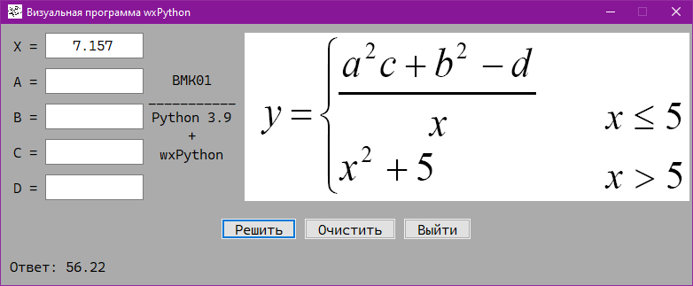
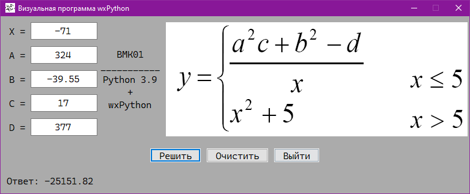
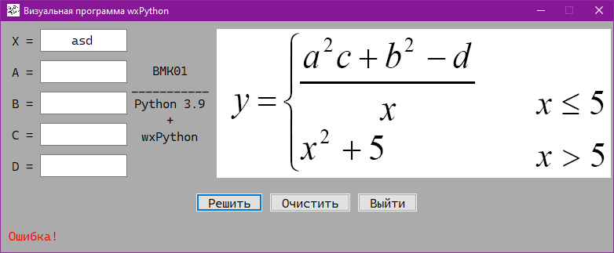

# BMK01_wxPython

## Современное кроссплатформенное программирование

### Практическая работа №9

### Вариант №1

Визуальная программа расчета математической величины по заданному в варианте алгоритму на wxPython c wxWidgets и кодом
формы от wxFormBuilder.

## Решение 1

## Решение 2

## Ошибка

